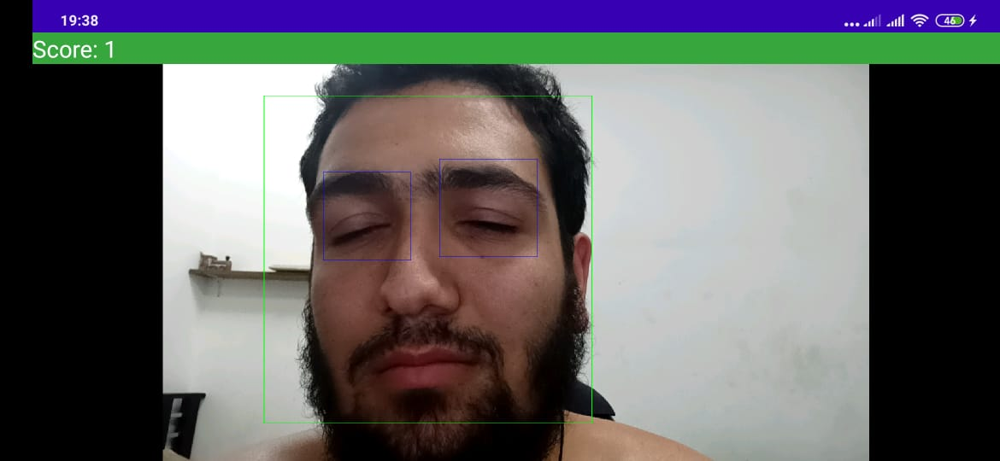
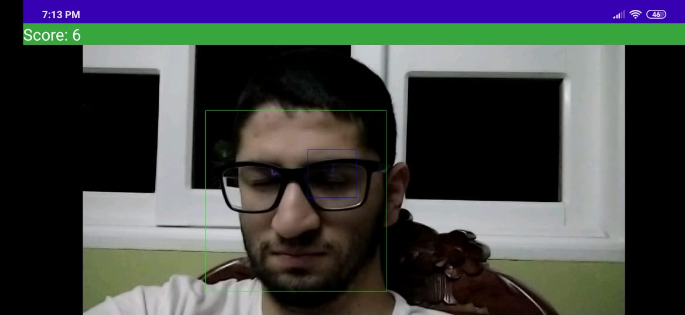
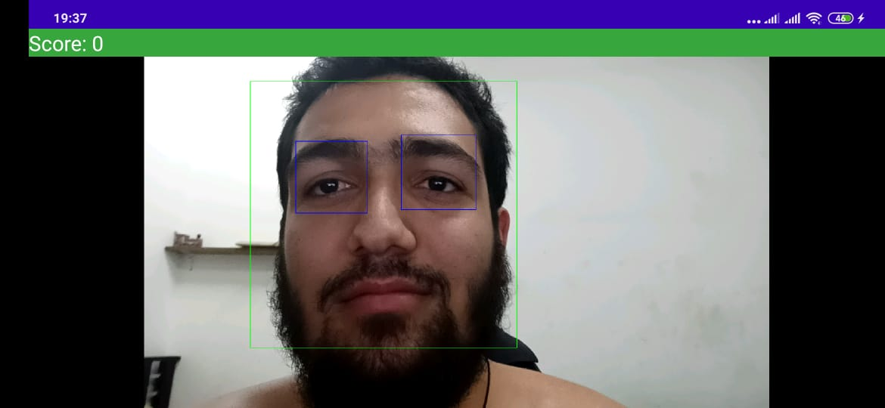
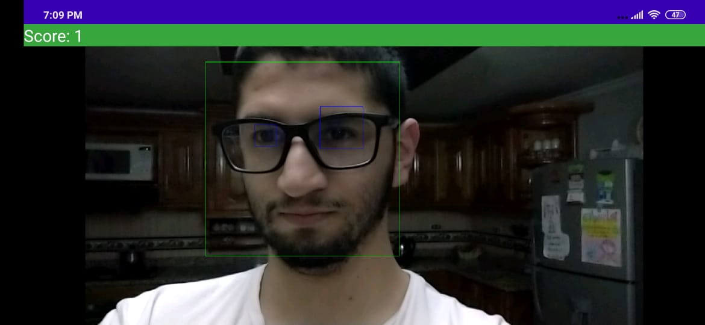

# No-Mimi

[Leon Dario Arango Amaya](https://github.com/breakermoob)

[Me](https://github.com/josearangos)

# Video - Tutorial

Sistema Detector de Somnolencia UdeA - OpenCV - Viola & Jones - Android

  

Android application for detect  driver drowsiness 

